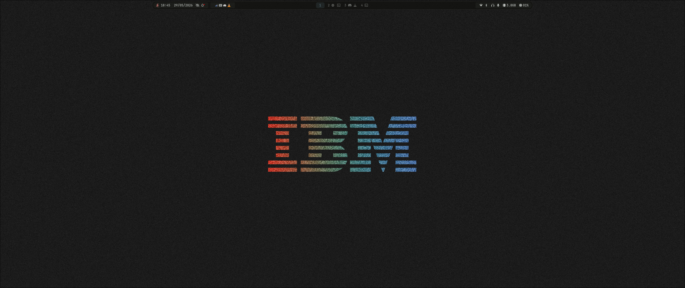

# dotfiles

My personal Hyprland desktop configurations, managed cleanly with GNU Stow.



## 🚀 Components Included
* **Hyprland**: Configured via a modular Lua configuration system (`hyprland.lua`).
* **Waybar**: Clean desktop status bar featuring dedicated, multi-player MPRIS status display (integrating `spotatui`, `cliamp`, `spotify`, `vlc`, `mpv`, `cider`, `cmus`, and `celluloid`).
* **Fuzzel**: Lightweight launcher & custom utility scripts:
  * `Alt + R`: Powermenu
  * `Alt + W`: Wi-Fi Manager
  * `Alt + C`: Clipboard History
  * `Alt + X`: Screenshot Menu
  * Clicking Waybar icons opens these menus directly.
* **hyprsunset**: System blue-light filter integrated into Hyprland:
  * Time-based temperature profiles via `hyprsunset.conf`.
  * `SUPER + ALT + Y`: Toggle blue-light filter on/off.
  * `SUPER + ALT + U`: Cycle screen temperatures (6000K, 5000K, 4000K, 3000K) with persistent desktop notifications.
* **Hyprlock & Hypridle**: Sleek modern screen lock with automated power management policies (dim at 10m, lock at 15m, screen off at 16m, suspend at 1h).
* **Wallpapers**: Curated wallpaper selection stored directly in `wallpapers/`.

## ⚙️ Installation

1. Clone this repository:
   ```bash
   git clone https://github.com/yourusername/dotfiles.git ~/dotfiles
   ```
2. Navigate to the folder and link the configurations using Stow:
   ```bash
   cd ~/dotfiles
   stow hypr waybar fuzzel bin
   ```

## 🤝 Credits
* The Waybar configuration was mostly provided by **HANCORE**, but modified by me to make it work on normal Hyprland and adapted to work with Fuzzel.
